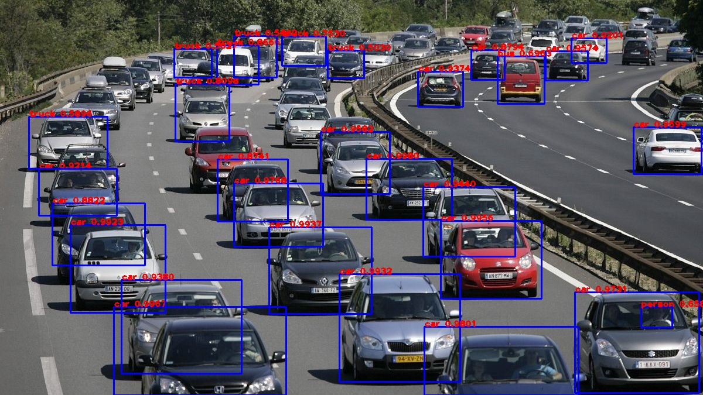

# Traffic Detection using YOLOv3 Algorithm
## Working
Traffic Detection is done by implementing the [YoloV3 model](https://pjreddie.com/yolo/) pretrained on the [coco dataset](https://cocodataset.org/#home) where required files can be downloaded from - 
1. [weights file](https://pjreddie.com/media/files/yolov3.weights) to be placed as `data\yolov3.weights`
2. [configuration file](https://github.com/pjreddie/darknet/blob/master/cfg/yolov3.cfg) to be placed as `data\yolov3.cfg.txt` (already placed)
3. [coco.names.txt](./data/coco.names.txt) file has been provided in the data folder
4. The Script implements the model in `tensorflow` from scratch using the cconfig file and implements `non max suppression` to output the final processed the video.
## Usage
1. Download the weights and configuration file and place it in the `data` folder
2. Place the required video to be processed in the `data/videos`
3. Change the global variable `video-name` inside `src/CAR-DETECTION.ipynb`
4. Running the `initialize_model` after executing the blocks one by one will generate the model file `output/yolo.h5`
5. Execute all cell blocks one by one if `yolo.h5` has not been created earlier, else skip `initialize_model` and execute `load_model`
6. Run the final block to get the output video in `outputs/output-videos` folder
7. To predict on images, `predict` function can be used and to predict on videos `predict_video` function can be used
## Sample Output Image

## Requirements
Requirements can be installed by running the following commands
```bash
pip install numpy
pip install matplotlib
pip install tensorflow
pip install opencv-python
```